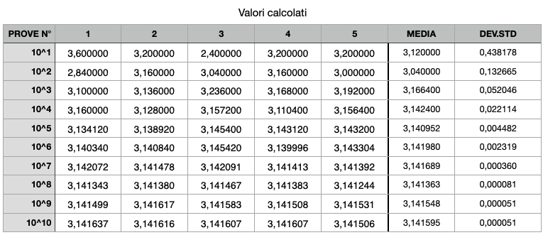

## Montecarlo pigreco

Algoritmo di approssimazione del pigreco tramite il metodo di montecarlo.
Nell esecuzione vengono utilizzati da 10 a (10^10) punti per l'approssimazione. Ogni iterazione viene eseguita 5 volte e per ogni iterazione viene memorizzato il valore calcolato con il proprio tempo di esecuzione.

#### Valori calcolati.
La tabella mostra il valore ottenuto del Pi.

#### Tempi di esecuzione.
La tabella mostra il tempo di esecuzione.

